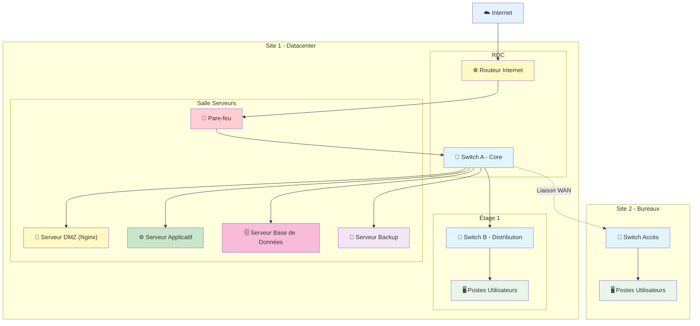

# Architecture Technique OMEGA

## Vue d'Infrastructure Logique (Corrigée)

```mermaid
graph TB
    subgraph "Internet"
        CLOUD["☁️ Internet"]
    end

    subgraph "LAN DDT"
        direction TB
        
        subgraph "Pare-feu"
            FW1["🧱 Pare-feu<br/>Adresse Pare-feu"]
        end

        subgraph "DMZ"
            DMZ["🔄 Reverse Proxy Nginx<br/>Adresse DMZ :443"]
        end

        subgraph "VLAN Utilisateur"
            USER["👤 Postes Utilisateurs DDT<br/>Adresse VLAN Utilisateur"]
        end

        subgraph "VLAN Admin"
            ADMIN["👨‍💼 Postes Administration<br/>Adresse VLAN Admin"]
        end
    end

    subgraph "Réseau Interne DDT - 10.28.8.0/24"
        subgraph "VLAN Applicatif + BDD"
            APP["⚙️ Serveur Applicatif OMEGA<br/>10.28.8.236<br/>Frontend: 3001 | Backend: 3000"]
            DB[("🗄️ PostgreSQL + PostGIS<br/>10.28.8.246:5432")]
        end
    end

    %% Flux Internet → DMZ
    CLOUD <-->|"HTTPS 443"| FW1
    FW1 <-->|"Routage"| DMZ

    %% Flux inter-VLAN
    FW1 <-->|"Filtrage"| USER
    FW1 <-->|"Filtrage"| ADMIN

    %% Flux DMZ → Applicatif
    DMZ <-->|"HTTP 3001"| APP
    DMZ <-->|"HTTP 3000"| APP

    %% Flux Applicatif → BDD (même réseau)
    APP <-->|"SQL 5432"| DB

    %% Styles
    style CLOUD fill:#e3f2fd
    style FW1 fill:#ffcdd2
    style DMZ fill:#fff9c4
    style USER fill:#e8f5e9
    style ADMIN fill:#fff3e0
    style APP fill:#c8e6c9
    style DB fill:#f8bbd9
```

## Vue d'Infrastructure Physique



## Tableau des Équipements (Corrigé)

| Équipement | IP | Réseau | Rôle | Ports |
|------------|-----|--------|------|-------|
| **Pare-feu** | Adresse Pare-feu | LAN DDT | Sécurité périmètre | 443, 22 |
| **Reverse Proxy Nginx** | Adresse DMZ | DMZ | Routage HTTPS → HTTP | 443 → 3000/3001 |
| **Serveur Applicatif** | 10.28.8.236 | Interne DDT | Node.js/React | 3000, 3001 |
| **Base de Données** | 10.28.8.246 | Interne DDT | PostgreSQL/PostGIS | 5432 |

## Plan d'Adressage IP (Corrigé)

| Réseau | Sous-réseau | Plage | Usage |
|--------|-------------|-------|-------|
| **DMZ** | À définir | - | Reverse Proxy Nginx (Adresse DMZ) |
| **Utilisateur** | À définir | - | Postes utilisateurs DDT (Adresse VLAN Utilisateur) |
| **Admin** | À définir | - | Postes administration (Adresse VLAN Admin) |
| **Interne DDT (Applicatif + BDD)** | 10.28.8.0/24 | .1 - .254 | Serveur OMEGA (10.28.8.236) + PostgreSQL (10.28.8.246) |

## Flux Réseau Détaillés

### 1. Accès Utilisateur (Internet → Application)
```
Internet
    ↓ HTTPS 443
Pare-feu (Adresse Pare-feu)
    ↓ Routage
DMZ - Nginx (Adresse DMZ:443)
    ↓ HTTP 3001 (Frontend) ou 3000 (Backend)
Serveur Applicatif (10.28.8.236)
```

### 2. Accès Base de Données (Application → BDD)
```
Serveur Applicatif (10.28.8.236)
    ↓ SQL 5432
PostgreSQL + PostGIS (10.28.8.246)
```

### 3. Administration (SSH)
```
Poste Admin (Adresse VLAN Admin)
    ↓ SSH 22
Pare-feu
    ↓ Filtrage
Serveur Applicatif (10.28.8.236:22)
```

## Sécurité Réseau

- **Segmentation VLAN** : Isolation par fonction
- **Pare-feu** : Filtrage inter-VLAN + NAT
- **DMZ** : Zone tampon pour services exposés
- **Pas de routage direct** : BDD non accessible depuis Internet
