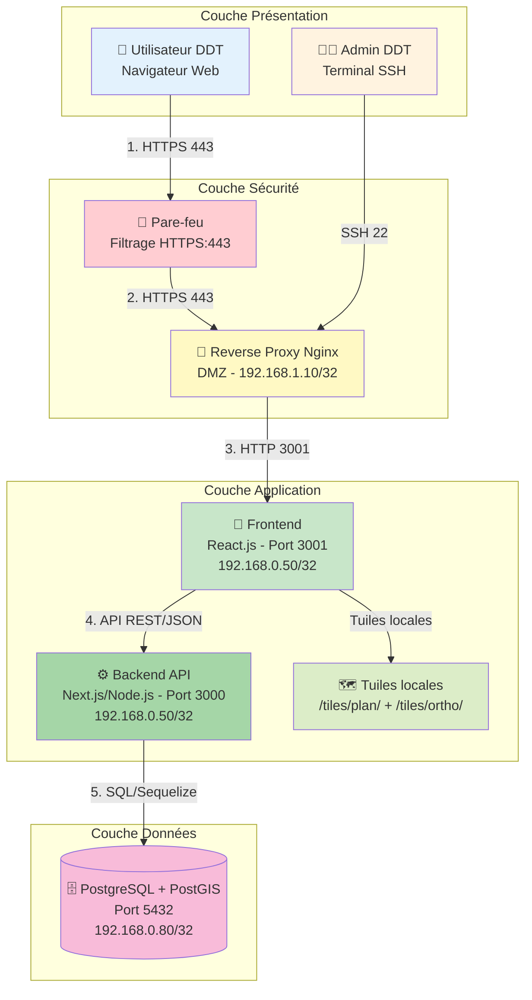
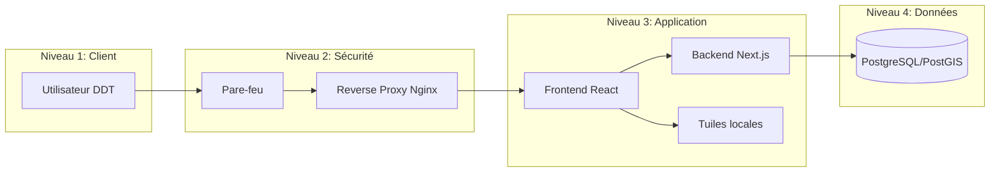

# Flux Applicatif OMEGA

## Architecture Applicative (β - Vue Hiérarchique)



## Architecture en Couches (β)



## Description des Flux

### 1. **Flux Utilisateur → Application**
```
Utilisateur DDT
    ↓ HTTPS 443
Pare-feu (Filtrage)
    ↓ HTTPS 443
Reverse Proxy (Nginx)
    ↓ HTTP 3001
Frontend React.js (Port 3001)
```

### 2. **Flux Frontend → Backend**
```
Frontend React.js
    ↓ API REST / JSON
Backend Next.js (Port 3000)
    ↓ Requêtes Sequelize
PostgreSQL + PostGIS (Port 5432)
```

### 3. **Flux Cartographie (Tuiles locales)**
```
Frontend React.js
    ↓ Requête tuiles locales
Fichiers tuiles (/tiles/plan/{z}/{x}/{y}.png)
    ↓ ou
Fichiers tuiles (/tiles/ortho/{z}/{x}/{y}.png)
```

### 4. **Flux Administration**
```
Admin DDT
    ↓ SSH 22
Reverse Proxy (Bastion)
    ↓ Accès direct
Serveur Applicatif (Gestion)
```

## Composants Détaillés

| Composant | Technologie | Port | Rôle |
|-----------|-------------|------|------|
| **Frontend** | React.js 18 | 3001 | Interface utilisateur, carte interactive |
| **Backend** | Next.js 13 / Node.js | 3000 | API REST, authentification, métier |
| **Base de données** | PostgreSQL 14 + PostGIS | 5432 | Stockage données, géométries |
| **Tuiles** | Fichiers PNG locaux | - | Fond de carte IGN (plan + ortho) |
| **Reverse Proxy** | Nginx | 443/80 | Routage, SSL, sécurité |

## Flux de Données par Fonctionnalité

### Authentification
```
Login Form → /api/auth/login → Vérification JWT → Session
```

### Gestion des Projets
```
Formulaire → /api/projets → CRUD → PostgreSQL
Carte → /api/projets/geometry → PostGIS → Affichage
```

### Audit et Sécurité
```
Actions utilisateur → SecurityLog → PostgreSQL (principale.security_log)
```

### Administration
```
Panel Admin → /api/admin/* → Gestion users/logs/snapshots
```

## Sécurité

- **Pare-feu** : Filtre les flux entrants (HTTPS uniquement)
- **VLAN DMZ** : Isolation du reverse proxy
- **VLAN BDD** : Base de données isolée, accès uniquement depuis backend
- **JWT** : Authentification stateless avec tokens signés
- **Audit** : Journalisation de toutes les actions sensibles
