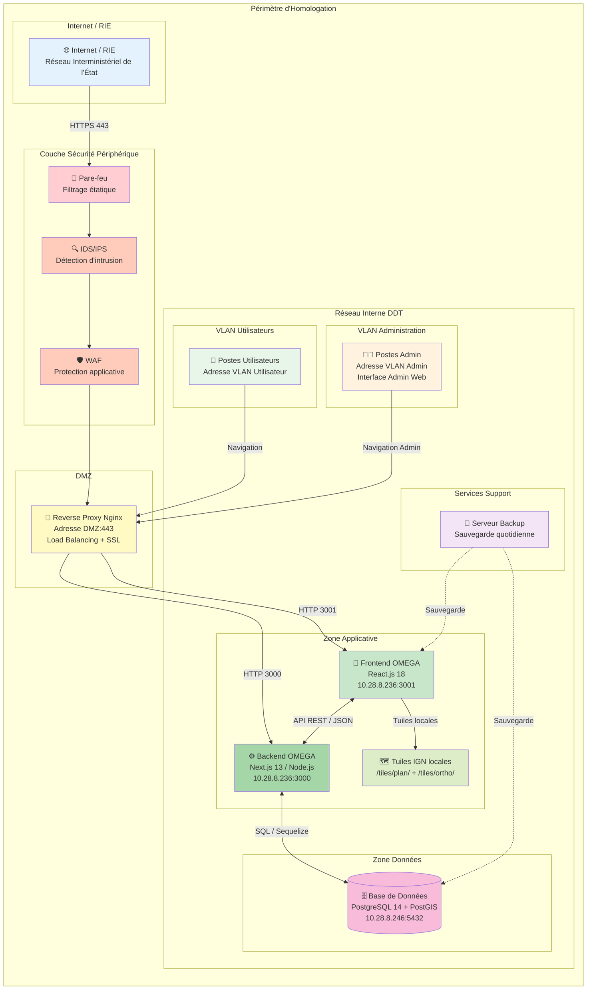

# Schéma Global du Système d'Information OMEGA

## Vue d'Ensemble de l'Architecture



## Composants Techniques Détaillés

### 1. **Infrastructure Réseau**

| Composant | Technologie | Fonction | Localisation |
|-----------|-------------|----------|--------------|
| **Pare-feu** | À définir | Filtrage étatique, NAT, VPN | Périmètre réseau |
| **IDS/IPS** | À définir | Détection/prévention intrusion | Périmètre réseau |
| **WAF** | À définir | Protection applicative (OWASP) | DMZ |
| **Reverse Proxy** | Nginx | Load balancing, SSL termination | DMZ |

### 2. **Serveurs Applicatifs**

| Composant | Technologie | Version | IP:Port | Rôle |
|-----------|-------------|---------|---------|------|
| **Frontend** | React.js | 18.x | 10.28.8.236:3001 | Interface utilisateur |
| **Backend** | Next.js / Node.js | 13.x / 16.x | 10.28.8.236:3000 | API REST, métier |
| **Tuiles** | Fichiers PNG | - | Local | Fond de carte IGN |

### 3. **Base de Données**

| Composant | Technologie | Version | IP:Port | Données |
|-----------|-------------|---------|---------|---------|
| **PostgreSQL** | PostgreSQL + PostGIS | 14.x | 10.28.8.246:5432 | Données métier + géométries |
| **Schémas** | principale, urbanisme, enr, environnement, risques, autres | - | - | Segmentation données |

### 4. **Sécurité**

| Composant | Technologie | Fonction |
|-----------|-------------|----------|
| **Authentification** | JWT | Tokens signés, expiration 4h |
| **Audit** | Security Log | Traçabilité ANSSI conforme |
| **Chiffrement** | HTTPS / SSL | TLS 1.2+ |
| **Sauvegarde** | À définir | Backup quotidien BDD + fichiers |

### 5. **Supervision**

| Composant | Fonction |
|-----------|----------|
| **Logs applicatifs** | Fichiers logs Node.js (backend) |
| **Logs base de données** | Logs PostgreSQL |
| **Audit** | Table `security_log` en base de données |

## Interconnexions et Flux

### Flux Utilisateur Standard
```
Internet/RIE
    ↓ HTTPS 443
Pare-feu → IDS → WAF
    ↓
Reverse Proxy Nginx (DMZ)
    ↓ HTTP 3001
Frontend React.js
    ↓ API REST
Backend Next.js
    ↓ SQL 5432
PostgreSQL + PostGIS
```

### Flux Administration
```
Poste Admin
    ↓ HTTPS 443
Pare-feu (filtrage IP admin)
    ↓
Reverse Proxy Nginx
    ↓
Frontend Admin → Backend → Base de données
```

**Interface Admin** : Gestion des utilisateurs, logs de sécurité, snapshots projets.

### Flux Sauvegarde
```
Serveur Backup
    ↓
├── PostgreSQL (dump quotidien)
├── Fichiers tuiles (/tiles/)
└── Logs et configuration
```

## Éléments de Sécurité

### 1. **Cloisonnement Réseau**
- ✅ DMZ isolée du réseau interne
- ✅ Base de données sur réseau dédié (10.28.8.0/24)
- ✅ Pas d'accès direct Internet → BDD

### 2. **Défense en Profondeur**
- ✅ Pare-feu (filtrage réseau)
- ✅ IDS/IPS (détection menaces)
- ✅ WAF (protection applicative)
- ✅ Authentification JWT (contrôle accès)

### 3. **Conformité**
- ✅ Architecture cloisonnée (DMZ)
- ✅ Logs de sécurité (ANSSI)
- ✅ Données en France (DDT)
- ✅ Pas de dépendance externe (tuiles locales)

## Périmètre d'Homologation

Les composants couverts par l'homologation sont dans le cadre orange :
- 🔒 **Toute l'infrastructure** du schéma ci-dessus
- 🔒 **Données géographiques** (projets DDT)
- 🔒 **Données utilisateurs** (authentification)

---

**Note** : Les adresses IP en "Adresse XXX" sont des placeholders à remplacer par les valeurs réelles de l'infrastructure DDT.
